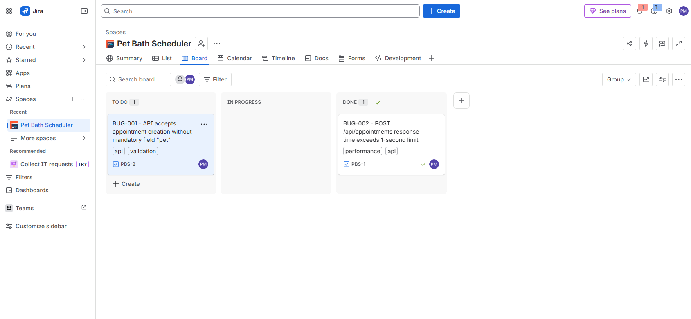

# 🐾 Pet Bath Scheduler

A **QA (Quality Assurance)** learning project focused on REST API testing and automation.

---

## 👩‍💻 About This Project

This is a simulated booking system for pet baths.
The main objective of this repository is to **demonstrate API testing skills**, including:

- ✅ Manual Testing with **Postman / Thunder Client**
- ✅ Validation of **Status Codes** (200, 201, 400, 500)
- ✅ Validation of **Response Body** (JSON structure)
- ✅ **Positive and Negative Scenario** testing
- ✅ BDD Automated E2E testing with **Playwright + Cucumber**

---

## 🚀 How to Run the Project

### Prerequisites
- [Node.js](https://nodejs.org/) installed

### Step 1: Install dependencies
```bash
npm install
```

### Step 2: Start the server
```bash
npm run dev
```

The server will run at: `http://localhost:3000`

---

## 🧪 How to Run the API Tests (Postman)

### Step 1: Download Postman
- Go to [postman.com](https://www.postman.com/downloads/) and download the Desktop version.

### Step 2: Import the Test Collection
1. Open Postman Desktop.
2. Click on **Import** (orange button in the top left).
3. Select the file: `Pet_Bath_Scheduler_QA_Tests.postman_collection.json`
4. The collection will appear in your sidebar!

### Step 3: Run the tests
1. With the server running (`npm run dev`), open the imported collection.
2. Click on **Run Collection**.
3. All tests will run automatically, and you will see the results in green ✅ or red ❌.

---

## 🧪 How to Run BDD Automated Tests (Cucumber + Playwright)

To execute the automated end-to-end user scenarios written in Gherkin syntax:

```bash
npx cucumber-js
```

---

## 📋 API Endpoints

| Method | URL | Description |
|--------|-----|-------------|
| `GET`  | `/api/appointments` | Returns all registered appointments |
| `POST` | `/api/appointments` | Creates a new appointment |

### Example JSON Payload for POST:
```json
{
  "owner": "Carlos",
  "phone": "99999-0000",
  "pet": "Bolinha",
  "breed": "Pug",
  "weight": "8",
  "date": "2026-05-30",
  "time": "14:00",
  "service": "Bath"
}
```

---

## ✅ Covered Test Cases

### GET /api/appointments
| # | Test | Acceptance Criteria |
|---|-------|----------------------|
| 1 | Status Code | Must be **200 OK** |
| 2 | Performance | Response time < 1000ms |
| 3 | Structure | Must return an Array |
| 4 | Fields | Each item must have `id`, `owner`, `pet`, `date` |

### POST /api/appointments
| # | Test | Acceptance Criteria |
|---|-------|----------------------|
| 1 | Status Code (positive) | Must be **201 Created** |
| 2 | Auto-generated ID | Field `id` must be generated and not null |
| 3 | Validated Data | `pet`, `owner`, and `breed` saved correctly |
| 4 | Status Code (negative) | Invalid payload must return **400 Bad Request** |

---

## 🔄 Bug Management & Tracking Flow (Jira)

To guarantee full traceability and monitor the lifecycle of each bug identified in the API, we use **Jira** to document, prioritize, assign development tasks, and validate the bug fixes.

### Example Jira Tickets Managed in the Project:

#### 1. BUG-001: API accepts appointment creation without mandatory field "pet"
* **Lifecycle:** Identified ➡️ Ticket created in `To Do` ➡️ Fix developed ➡️ Verified by QA and moved to `Done`.

| Ticket Created (To Do) | Ticket Resolved (Done) |
|:---:|:---:|
|  |  |

#### 2. BUG-002: POST Response Time Exceeds Quality Threshold
* **Lifecycle:** Identified ➡️ Investigated and optimized in the backend ➡️ Verified by QA and moved to `Done`.

| Ticket Resolved (Done) |
|:---:|
|  |

---

## 🛠️ Technologies Used

- **Next.js** - Server Framework (Backend/Frontend)
- **Playwright** - Automation Engine
- **Cucumber (BDD)** - Test Scenario Parser (Gherkin)
- **Postman** - API Testing tool
- **Thunder Client** - VS Code API testing extension
