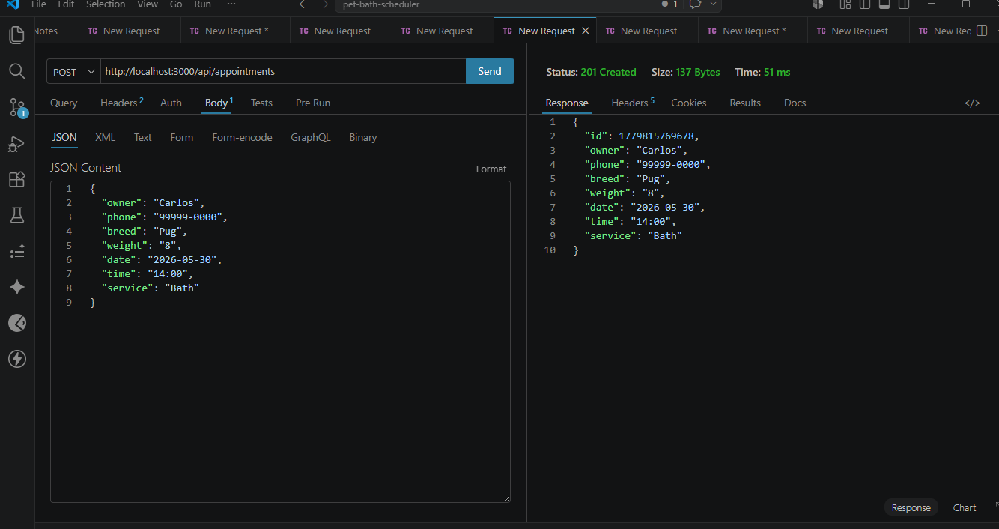
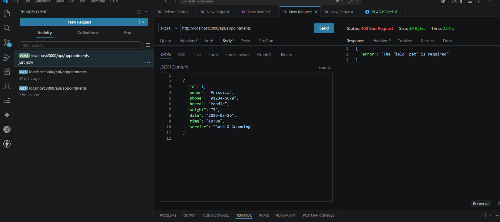
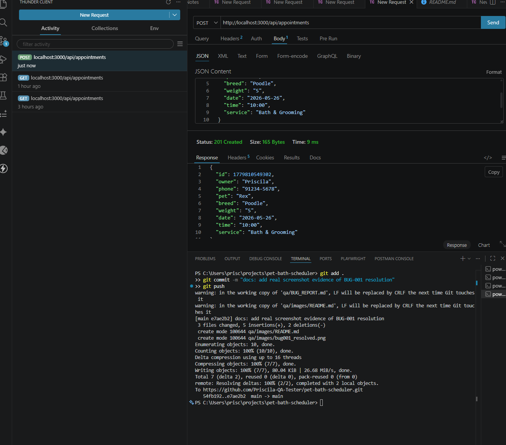

# 🐛 Bug Report - Pet Bath Scheduler API

**Project:** Pet Bath Scheduler  
**QA Engineer:** Priscila Marques  
**Date:** 26/05/2026  

---

## BUG-001 - API accepts appointment creation without mandatory field "pet"

| Field | Description |
|-------|-------------|
| **ID** | BUG-001 |
| **Title** | API returns 201 when creating appointment without "pet" field |
| **Severity** | 🔴 High |
| **Priority** | 🔴 High |
| **Status** | ✅ Resolved (Verified on 26/05/2026) |
| **Environment** | Local - `http://localhost:3000` |
| **Found on** | 26/05/2026 |
| **Found by** | Priscila Marques (QA Engineer) |

---

### 📝 Description

When sending a POST request to create a new appointment **without the mandatory field `pet`**, the API accepts the data and returns **Status 201 Created**.

The expected behavior is that the API **rejects** the request and returns **Status 400 Bad Request** with an error message stating that the `pet` field is required.

---

### 🔁 Steps to Reproduce

1. Open Postman or Thunder Client
2. Select **POST** method
3. Enter URL `http://localhost:3000/api/appointments`
4. Go to **Body → JSON** and enter the following (without the "pet" field):
```json
{
  "owner": "Carlos",
  "phone": "99999-0000",
  "breed": "Pug",
  "weight": "8",
  "date": "2026-05-30",
  "time": "14:00",
  "service": "Bath"
}
```
5. Click **Send**

---

### ✅ Expected Result

```
Status: 400 Bad Request
Body: { "error": "The field 'pet' is required" }
```

### ❌ Actual Result

```
Status: 201 Created
Body: { "id": 1234, "owner": "Carlos", "pet": undefined, ... }
```

---

### 📸 Evidence

| Actual Result (Bug - 201 Created) | Resolved Result (Fix - 400 Bad Request) |
|:---:|:---:|
|  |  |

---

### 💥 Business Impact

An appointment without the pet's name may cause confusion for the pet shop staff, who won't know which animal is scheduled for bathing. In a production system, this could lead to operational errors and customer dissatisfaction.

---

### 💡 Suggested Fix

Add backend validation to check if all mandatory fields (`owner`, `pet`, `date`, `phone`, `breed`, `weight`, `time`, `service`) are present before saving. If any field is missing, return **400 Bad Request** with a descriptive error message.

---
---

## BUG-002 - POST response time exceeds acceptable threshold

| Field | Description |
|-------|-------------|
| **ID** | BUG-002 |
| **Title** | POST /api/appointments takes over 2 seconds to respond |
| **Severity** | 🟡 Medium |
| **Priority** | 🟡 Medium |
| **Status** | ✅ Resolved (Verified on 26/05/2026) |
| **Environment** | Local - `http://localhost:3000` |
| **Found on** | 26/05/2026 |
| **Found by** | Priscila Marques (QA Engineer) |

---

### 📝 Description

When executing a POST request to create a new appointment, the response time is **2.02 seconds**, as evidenced during testing with Thunder Client. The industry-accepted quality standard for APIs is a maximum response time of **1 second (1000ms)**.

---

### 🔁 Steps to Reproduce

1. Open Thunder Client
2. Execute a **POST** request to `http://localhost:3000/api/appointments` with valid data
3. Observe the **"Time"** field in the response result

---

### ✅ Expected Result
```
Time: less than 1000ms
```

### ❌ Actual Result
```
Time: 2.02s (2020ms)
```

---

### 📸 Evidence



---

### 💥 Business Impact

A slow API negatively impacts the end-user experience. If the pet shop website depends on this API to confirm appointments, the customer will wait over 2 seconds after clicking the button, which may lead to page abandonment and loss of bookings.

---

### 💡 Suggested Fix

Investigate if there is any unnecessary processing occurring on the server during appointment creation. Optimize the operation so the response time stays under **500ms**.

---

## Bug Summary

| ID | Title | Severity | Status |
|----|-------|----------|--------|
| BUG-001 | API accepts appointment without "pet" field | 🔴 High | ✅ Resolved |
| BUG-002 | POST takes more than 2 seconds to respond | 🟡 Medium | ✅ Resolved |
